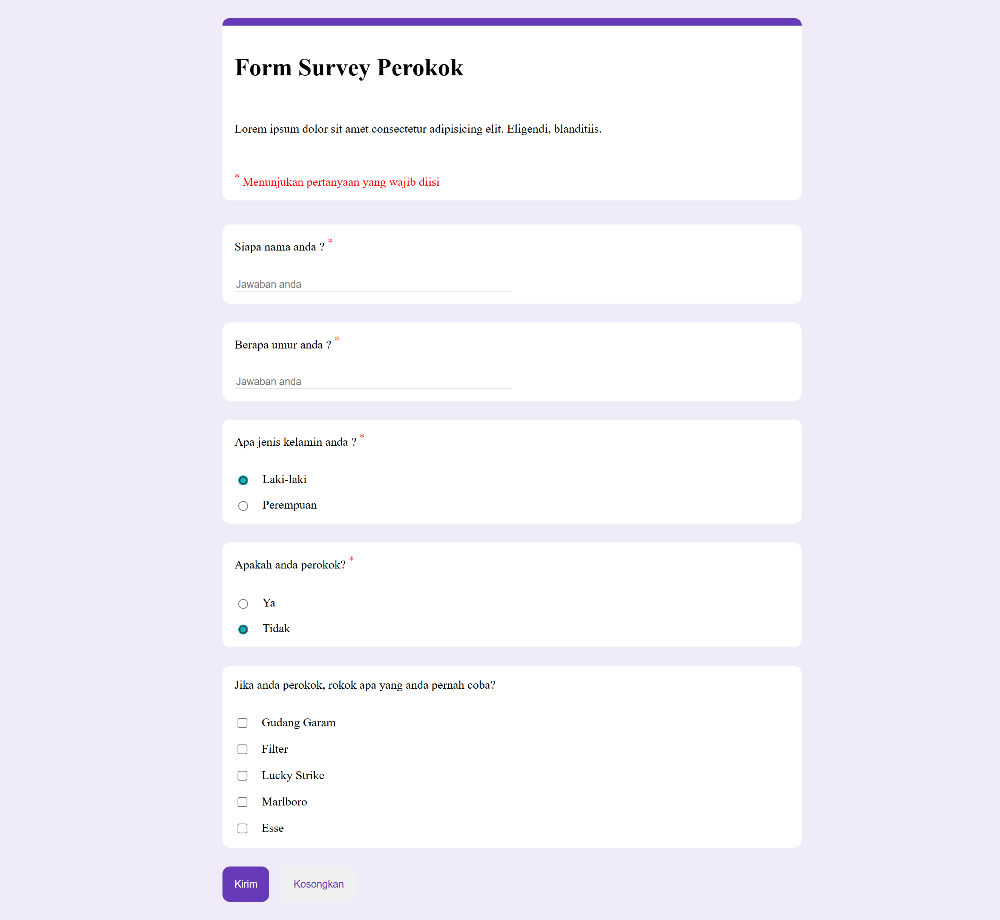
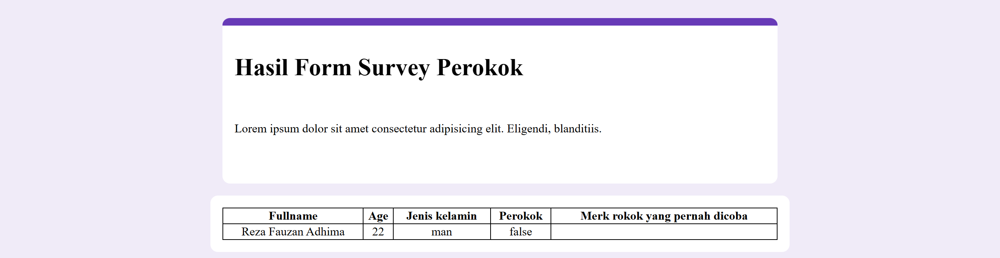

# Create Google Form Like to collect survey data from smoker
and app with ui Google Form like to collect and store smoker survey respond in local storage and show it in result page

## Form

## Result

## How to run it
- simple as download the source code and open it in browser or live server(Recommended)